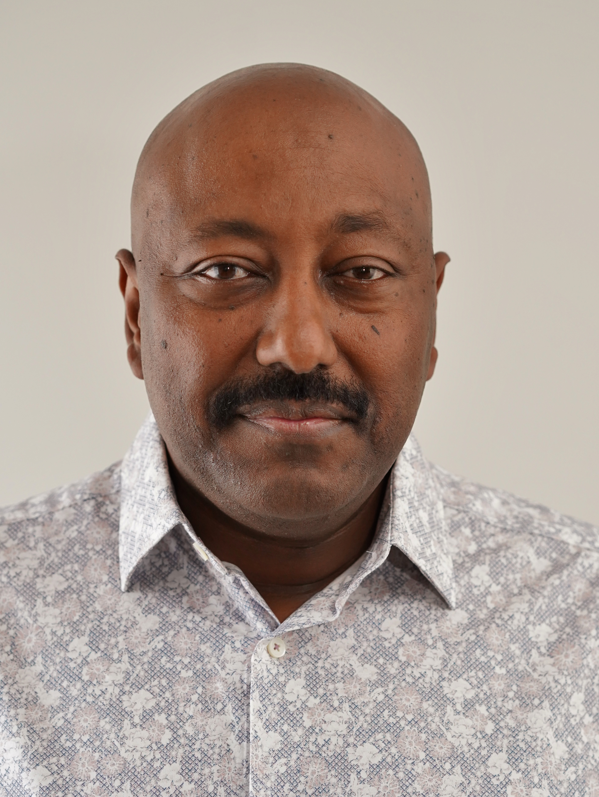

```{=html}
<div style="text-align: center; margin-bottom: 2rem;">
  
</div>


I’m a Principal Data Scientist specializing in high‑stakes decision systems across regulated and operationally complex domains. My work focuses on building models and workflows that organizations can trust, especially when the cost of a wrong decision is high.

I approach data science by modeling the decision, not just the dataset. That means reducing ambiguity before increasing complexity, aligning statistical rigor with operational constraints, and designing systems that are reliable, explainable, and durable in real‑world environments.

My experience spans fraud detection, clinical workflow optimization, compliance automation, and risk‑aware modeling frameworks. Across these areas, I focus on measurable impact, auditability, and the ability for systems to operate under real constraints rather than idealized assumptions.

My background blends data science, risk modeling, and technical program management. That combination helps me align stakeholders, clarify requirements, and deliver systems that work beyond the prototype stage.
```